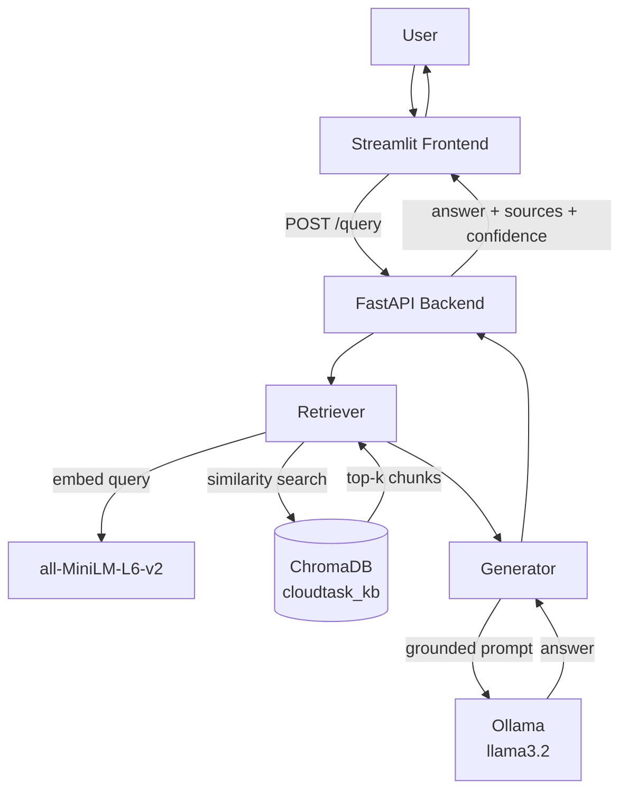

# CloudTask-AI-Support-Copilot
🤖 A local RAG-powered AI support copilot that answers CloudTask (SaaS project-management) customer questions from official documentation, with cited sources — built with FastAPI, ChromaDB, and Ollama (Llama 3.2).


# 🤖 CloudTask AI Support Copilot

A local, Retrieval-Augmented Generation (RAG) powered AI support assistant that
answers customer questions for **CloudTask** — a fictional project-management
SaaS product — using its official PDF documentation. Answers are always
grounded in retrieved context and cited by source document, section, and page,
with no hosted/paid LLM APIs involved.

**Repository:** https://github.com/mennamohammedkh/CloudTask-AI-Support-Copilot

---

## 📖 Overview

Support teams spend a lot of time answering the same questions about billing,
account settings, product limits, and integrations. This project builds an
end-to-end AI copilot that retrieves the right documentation section for a
customer's question and generates a concise, source-cited answer — instead of
guessing from general LLM knowledge.

The system is built entirely with **local, open-source components**:
embeddings via `sentence-transformers`, vector search via `ChromaDB`, and
generation via a locally-hosted **Ollama** LLM (`llama3.2`) — no data ever
leaves the machine, and there are no API costs.

---

## 🏗️ Architecture



The **notebook** (`notebooks/rag_pipeline.ipynb`) is the offline indexing +
evaluation pipeline: it processes the source PDFs into the persisted
`vector_store/` that the backend loads at startup. The **backend** never
re-computes document embeddings or rebuilds the vector store at request time
— only the user's question is embedded per request.

---

## 🛠️ Tech Stack

| Layer | Technology |
|---|---|
| Data processing / evaluation | Jupyter Notebook, `pypdf`, `pandas` |
| Embeddings | `sentence-transformers` (`all-MiniLM-L6-v2`, 384-dim, normalized) |
| Vector store | `ChromaDB` (persistent, cosine similarity) |
| LLM | `Ollama` running `llama3.2` (local, no hosted API) |
| Backend | `FastAPI`, `Pydantic`, `Uvicorn` |
| Frontend | `Streamlit` |
| Testing | `pytest`, `httpx` |

---

## 📁 Project Structure

```
CloudTask-AI-Support-Copilot/
├── notebooks/
│   └── rag_pipeline.ipynb          # Load → Chunk → Embed → Retrieve → Evaluate → Export
│
├── backend/
│   ├── app/
│   │   ├── main.py                 # FastAPI app: /health, /query
│   │   ├── config.py               # Settings loaded from .env
│   │   ├── schemas.py              # Pydantic request/response models
│   │   └── rag/
│   │       ├── retriever.py        # Embedding model + ChromaDB
│   │       ├── generator.py        # Prompt building + Ollama call
│   │       └── pipeline.py         # rag_query(): retrieve + generate + package
│   ├── tests/
│   │   └── test_query.py           # 5 pytest tests (happy path + validation)
│   ├── data/
│   │   ├── vector_store/           # Copied from the notebook's export step
│   │   └── vector_store_config.json
│   ├── requirements.txt
│   └── .env.example
│
├── frontend/
│   ├── app.py                      # Streamlit chat interface
│   ├── api_client.py                # Backend HTTP wrapper (reads API_BASE_URL)
│   ├── requirements.txt
│   └── .env.example
│
├── data/raw/                        # The 12 source PDFs, by category
│   ├── billing/
│   ├── account/
│   ├── technical/
│   └── product/
│
├── .gitignore
└── README.md
```

---

## 📚 Domain & Data

The knowledge base consists of **12 original PDF documents** (authored for
this project, ~13 pages total) covering CloudTask's documentation across 4
categories:

| Category | Documents |
|---|---|
| Billing | `refund_policy.pdf`, `billing_faq.pdf`, `subscription_policy.pdf` |
| Account | `account_management.pdf`, `password_and_login.pdf`, `user_management.pdf` |
| Technical | `troubleshooting_guide.pdf`, `integrations_guide.pdf`, `api_error_guide.pdf` |
| Product | `product_faq.pdf`, `features_guide.pdf`, `usage_and_limits.pdf` |

All 12 files are text-extractable (no OCR needed, 0 parsing failures).

**Chunking strategy:** section-based (not fixed-size) — the documents are
authored with numbered sections (`1. Overview`) or FAQ-style headings
(`Q1: ...`), so chunks are split along those natural boundaries rather than
an arbitrary token count. This produced **68 chunks**, averaging 43 words each
(range: 16–91 words), with 0 chunks exceeding a 150-word safety threshold.
See the notebook's Section 2.2 for the full justification.

---

## ⚙️ Setup

### Prerequisites
- Python 3.10+
- [Ollama](https://ollama.com) installed, with the model pulled:
  ```bash
  ollama pull llama3.2
  ```

### Backend

```bash
cd backend
python -m venv .venv
source .venv/bin/activate      # Windows: .venv\Scripts\activate
pip install -r requirements.txt

cp .env.example .env           # adjust values if needed

uvicorn app.main:app --reload
```

Verify: open `http://localhost:8000/docs`, or:
```bash
curl http://localhost:8000/health
```

### Frontend

In a second terminal:
```bash
cd frontend
python -m venv .venv
source .venv/bin/activate
pip install -r requirements.txt

cp .env.example .env           # set API_BASE_URL if backend isn't on localhost:8000

streamlit run app.py
```

Open the URL Streamlit prints (default `http://localhost:8501`) and ask a
question, e.g. *"How do I reset my password?"*

### Rebuilding the vector store (optional)

The `backend/data/vector_store/` folder already ships in this repo (it's
small — see `.gitignore` for why), so the backend runs immediately after
cloning. To rebuild it from scratch instead, run
`notebooks/rag_pipeline.ipynb` top-to-bottom (Kernel → Restart & Run All),
then copy the resulting `data/vector_store/` and `data/vector_store_config.json`
into `backend/data/`.

---

## 🔧 Environment Variables

**`backend/.env`**

| Variable | Default | Description |
|---|---|---|
| `VECTOR_STORE_PATH` | `./data/vector_store` | Path to the persisted ChromaDB store |
| `VECTOR_STORE_COLLECTION` | `cloudtask_kb` | ChromaDB collection name |
| `EMBEDDING_MODEL` | `all-MiniLM-L6-v2` | Must match the model used to build the vector store |
| `LLM_MODEL` | `llama3.2` | Ollama model name |
| `OLLAMA_HOST` | `http://localhost:11434` | Ollama server URL |
| `DEFAULT_TOP_K` | `3` | Default number of chunks retrieved per query |
| `ALLOWED_ORIGINS` | `http://localhost:8501,http://localhost:7860` | CORS-allowed frontend origins |

**`frontend/.env`**

| Variable | Default | Description |
|---|---|---|
| `API_BASE_URL` | `http://localhost:8000` | URL of the FastAPI backend |

---

## 🔌 API Reference

### `GET /health`

```bash
curl http://localhost:8000/health
```

```json
{
  "status": "ok",
  "service": "CloudTask AI Support Copilot",
  "rag_ready": true,
  "llm_model": "llama3.2",
  "embedding_model": "all-MiniLM-L6-v2"
}
```

### `POST /query`

```bash
curl -X POST http://localhost:8000/query \
  -H "Content-Type: application/json" \
  -d '{"question": "How do I reset my password?", "top_k": 3}'
```

```json
{
  "answer": "Click Forgot Password on the login screen and enter your account email. A reset link is sent and expires after 30 minutes.",
  "sources": [
    "password_and_login.pdf — Resetting Your Password (page 1)"
  ],
  "retrieved_chunks": [
    {
      "source": "password_and_login.pdf",
      "section": "Resetting Your Password",
      "pages": "1",
      "distance": 0.185
    }
  ],
  "confidence": 0.815
}
```

`question` must be 1–1000 characters; `top_k` must be between 1 and 10.
Invalid input returns `422`; a not-yet-ready backend returns `503`.

---

## 📊 Evaluation Results

The notebook's Section 2.5 tests retrieval + generation against 10 hand-written
questions spanning all 4 categories, with a known expected source document for
each (ground truth), since the documentation was authored for this project.

| Metric | Result |
|---|---|
| Retrieval accuracy (Top-1 matches expected source) | **90% (9/10)** |
| Total chunks in knowledge base | 68 |
| Test questions | 10 |

**The one retrieval miss:** *"What is the API rate limit on the Business
plan?"* retrieved `api_error_guide.pdf` instead of the expected
`usage_and_limits.pdf`. This wasn't a retrieval bug — both documents genuinely
state the same fact (500 req/min), so the retriever returned an equally valid
alternative source rather than the single hand-picked "ground truth" file.
See the notebook for the full analysis and a suggested fix (allowing multiple
acceptable sources per question).

**Generation quality** (grounded vs. hallucinated) was assessed manually per
answer against its cited chunk(s) — see the `grounded` / `notes` columns in
`eval_df` (exported to `evaluation_results.csv`) in the notebook.

---

## 🖼️ Screenshots

_Add screenshots of the running app here before submission, e.g.:_

```markdown


```

---

## 🧪 Running Tests

```bash
cd backend
pytest tests/ -v
```

5 tests covering `/health`, a `/query` happy path, and 3 validation error
cases (empty question, `top_k` out of range, missing field) — all mocked so
they run without a live Ollama server or internet connection.

---

